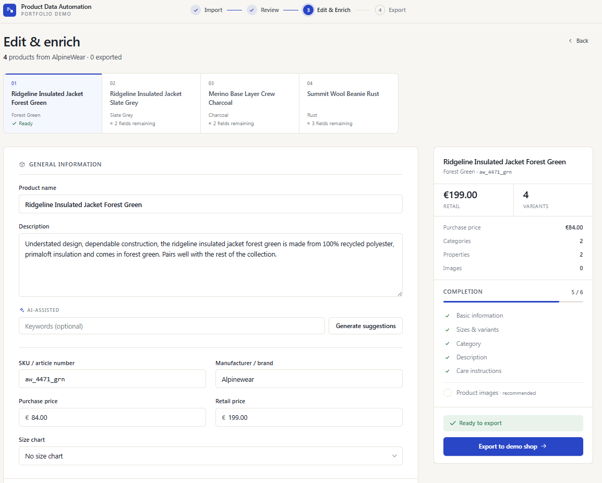
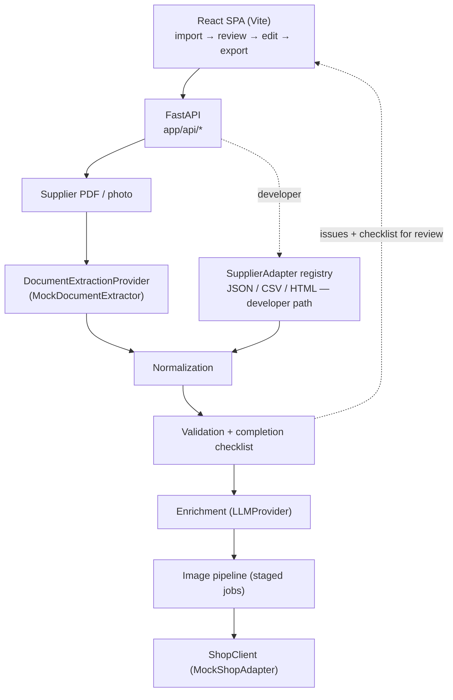
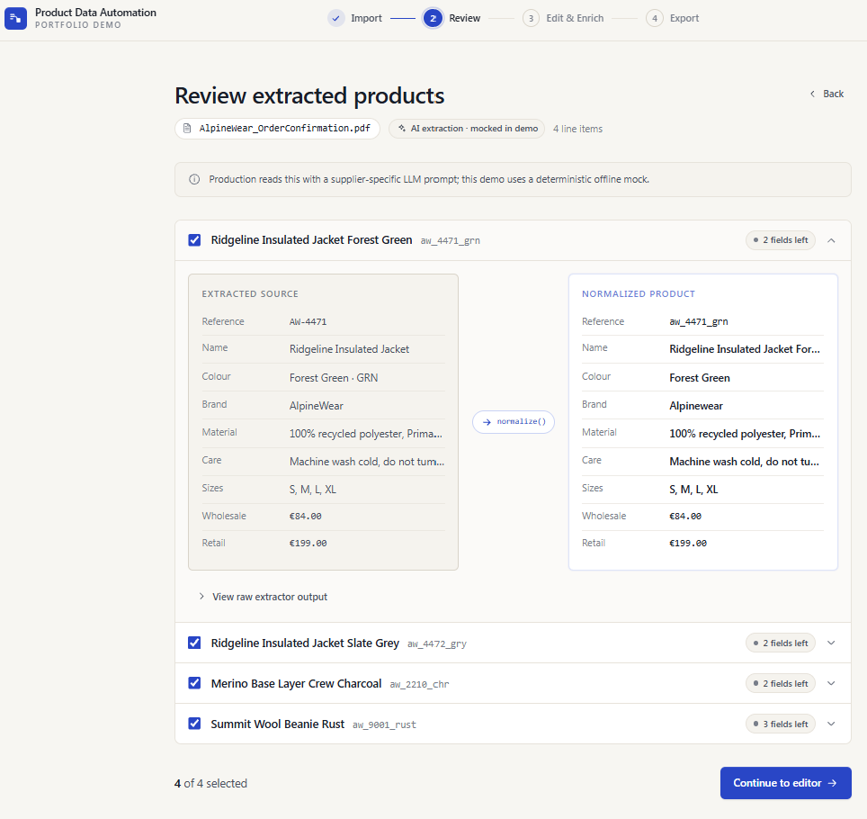
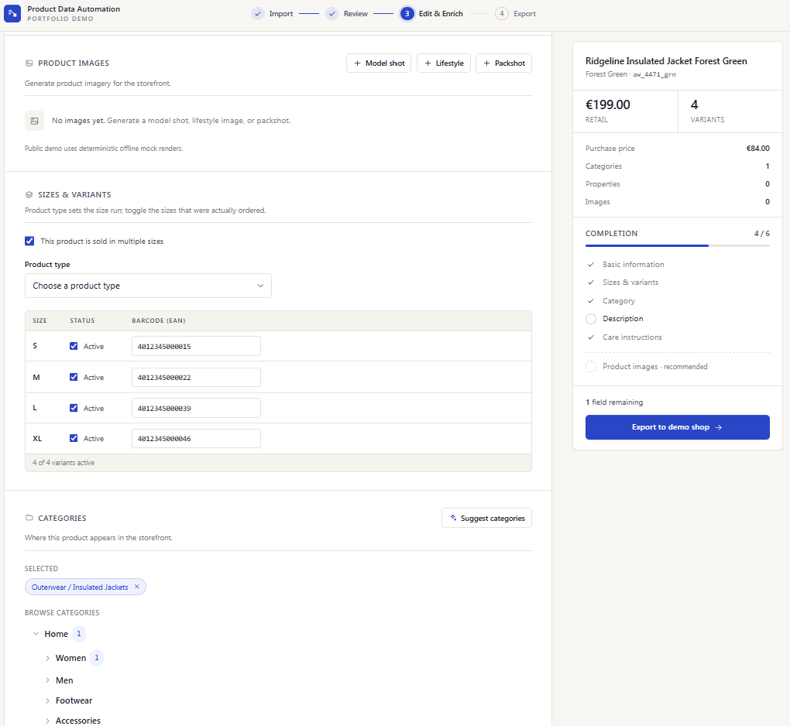
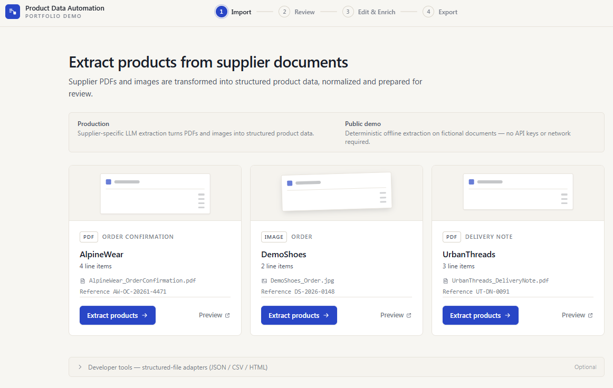

# Product Data Automation Platform

A full-stack product-onboarding platform that automates the path from supplier
documents to shop-ready products.

The production system I developed supports **20+ supplier-specific workflows**
and combines AI-assisted document extraction, product-data normalization,
human review, content and image enrichment, and Shopware integration in one
workflow.

This repository is a public portfolio reimplementation of the core architecture
and workflow using fictional suppliers and offline providers.
Employer code, supplier data, prompts, credentials, and business
rules are not included.



## The problem

Product onboarding was highly manual: supplier documents arrived in different
formats, with inconsistent article numbers, colours, sizes, EANs, pricing, and
product metadata.

Each product had to be extracted, normalized, reviewed, enriched with content
and images, and finally created in Shopware.

With **20+ supplier-specific workflows**, this process became difficult to scale
and easy to get wrong.

The platform turns that fragmented workflow into one structured pipeline with a
human review and editing step before products are published.

## Pipeline

The platform turns supplier input into one standardized product workflow:

```text
Supplier PDF / image
        ↓
Document extraction
        ↓
Raw supplier product
        ↓
Normalization
        ↓
Validation + completion
        ↓
Human review & editing
        ↓
AI-assisted enrichment
        ↓
Image generation
        ↓
Shop export
```



For suppliers that already provide structured data, the platform also supports
JSON, CSV, and HTML imports through `SupplierAdapter`s. Each adapter converts its
input into the same `RawSupplierProduct` format, so the rest of the pipeline can
stay independent of the supplier or source format.



## Architecture

### One product model after normalization

Supplier inputs can look completely different, but after normalization the rest
of the application works with the same `NormalizedProduct` model.

That model contains the supplier-derived data such as article numbers, prices,
variants, material and care instructions, together with fields added during
review and enrichment such as categories, properties and descriptions.

This keeps the downstream pipeline independent of the supplier that originally
provided the product.

### Provider boundaries for external services

External services are hidden behind small provider interfaces. Document
extraction, LLM enrichment, image generation, object storage and shop access can
therefore be replaced without changing the rest of the application.

The public repository uses deterministic offline implementations so the entire
workflow can be run without credentials or external services.

| | Production | Public demo |
|---|---|---|
| Document extraction | Supplier-specific LLM extraction from PDF / image | `MockDocumentExtractor` over bundled fictional documents |
| Suppliers | 20+ configured workflows | 3 fictional suppliers |
| Content enrichment | Hosted LLM | `MockLLMProvider` |
| Product images | External AI image service | `MockImageProvider` |
| Shop integration | Shopware 6 Admin API | `MockShopAdapter` |
| Object storage | Cloud storage | `LocalObjectStorage` |

### Validation and completion are separate

The platform treats incorrect data and incomplete data differently.

`validate()` checks whether the product data itself is valid, for example missing
prices, duplicate sizes or invalid values.

`build_checklist()` checks whether the product is ready to be exported, for
example whether a description or category is still missing.

This distinction is also reflected in the UI: real validation problems are shown
as errors, while unfinished products simply show their completion progress.

### Supplier registry

Structured supplier feeds use registered `SupplierAdapter`s instead of
supplier-specific conditionals throughout the codebase.

Each adapter converts its source format into `RawSupplierProduct`. Adding another
structured supplier therefore means adding a new adapter without changing the
normalization or downstream workflow.

### Backend

| Path | Purpose |
|---|---|
| `app/domain/` | Core models such as `NormalizedProduct`, `Money`, validation types and pricing rules |
| `app/services/extraction/` | Document extraction interface, offline mock and fictional demo-document fixtures |
| `app/suppliers/` | `SupplierAdapter` interface, registry and structured-feed adapters |
| `app/services/` | Normalization, validation, completion, enrichment, image processing and external-service boundaries |
| `app/api/` | FastAPI routes and centralized API error handling |

### Frontend

The frontend is a React/Vite application built around the four main workflow
steps: **import → review → edit & enrich → export**.

`src/lib/api.js` provides the shared API layer, while the editor keeps a separate
editable state for each product and continuously re-evaluates validation and
completion as the user makes changes.

The main editor components live in `src/components/editor/`, with shared UI
components in `src/components/ui.jsx`.



## Technical decisions

| Decision | Why |
|---|---|
| `DocumentExtractionProvider` as an extraction boundary | Keeps document extraction independent of the concrete LLM or demo implementation |
| Demo documents generated from shared fixtures | The bundled PDF / image always matches the data returned by the mock extractor |
| One `NormalizedProduct` after normalization | Gives the rest of the application a single supplier-independent product model |
| Supplier registry instead of call-site conditionals | New structured suppliers can be added without changing the downstream pipeline |
| Validation separated from completion | Invalid data and unfinished data are different problems and should be handled differently in the UI |
| `Money` as a value object | Keeps amount and currency together and makes rounding explicit |
| Staged image jobs with an injectable job store | Supports asynchronous image processing and can be adapted to multi-worker deployments |
| Centralized domain-to-HTTP error mapping | Keeps API handlers small and prevents transport concerns from leaking into the domain logic |

## Run it

The demo runs entirely offline. No API keys, credentials, or external services
are required.



### Backend

Requires Python 3.11+.

```bash
cd backend
python -m venv .venv
```

Activate the environment:

```bash
# macOS / Linux
source .venv/bin/activate

# Windows PowerShell
.venv\Scripts\Activate.ps1
```

Then start the API:

```bash
pip install -r requirements.txt
uvicorn app.main:app --reload --port 8000
```

The API is available at `http://localhost:8000`, with interactive documentation
at `http://localhost:8000/docs`.

### Frontend

Requires Node.js 18+.

```bash
cd frontend
npm install
npm run dev
```

Open `http://localhost:5173`.

Choose one of the bundled fictional supplier documents and click **Extract
products**. From there, the demo walks through extraction, normalization, review,
editing and enrichment, and finally shop export.

Structured JSON, CSV, and HTML inputs are also available through **Developer
tools** on the import screen.

## Tests

```bash
cd backend && pytest          # 100 tests
ruff check .
cd ../frontend && npm run build && npx eslint .
```

The backend tests cover document extraction and its failure modes, each adapter's
parsing quirks and malformed input, every validation rule, the checklist, pricing
and size resolution, the enrichment merge, the shop payload builder and its
idempotency, the image pipeline, and the HTTP API end to end.

## My contribution

I developed the production system as part of my work on product-data automation.
My work included the supplier extraction and normalization pipeline, the canonical
product model, validation, the FastAPI backend, provider-agnostic LLM integration,
the Shopware Admin API integration, staged image processing, the React-based
review workflow, and automated tests.

This repository is a separate public reimplementation of that system's core
workflow and engineering ideas. Proprietary integrations and business-specific
logic have been replaced with fictional data and deterministic offline
implementations.

The production system uses supplier-specific LLM extraction, external image
generation, cloud storage, and the Shopware Admin API. In this repository those
boundaries are represented by mock providers so the full workflow can be explored
without credentials or access to internal systems.

The structured JSON, CSV, and HTML `SupplierAdapter`s are an additional
developer-facing demo path included specifically in this public version.

## Repository layout

```
backend/
  app/
    api/            FastAPI routers + error mapping
    domain/         NormalizedProduct, Money, ValidationIssue, PricingPolicy
    suppliers/      SupplierAdapter interface, registry, 3 adapters
    services/
      extraction/   DocumentExtractionProvider + mock + demo-document fixtures
      llm/          provider interface + deterministic mock
      shop/         shop-client interface + in-memory adapter (payload builder)
      normalization.py / validation.py / completeness.py / enrichment.py / pipeline.py / images.py
    utils/          text + size-range helpers
  tests/
scripts/            generate_demo_documents.py
frontend/src/
  lib/api.js        single API layer
  components/        wizard steps + editor sections + UI kit
demo_data/           the 3 fictional documents + 3 structured feeds
```
