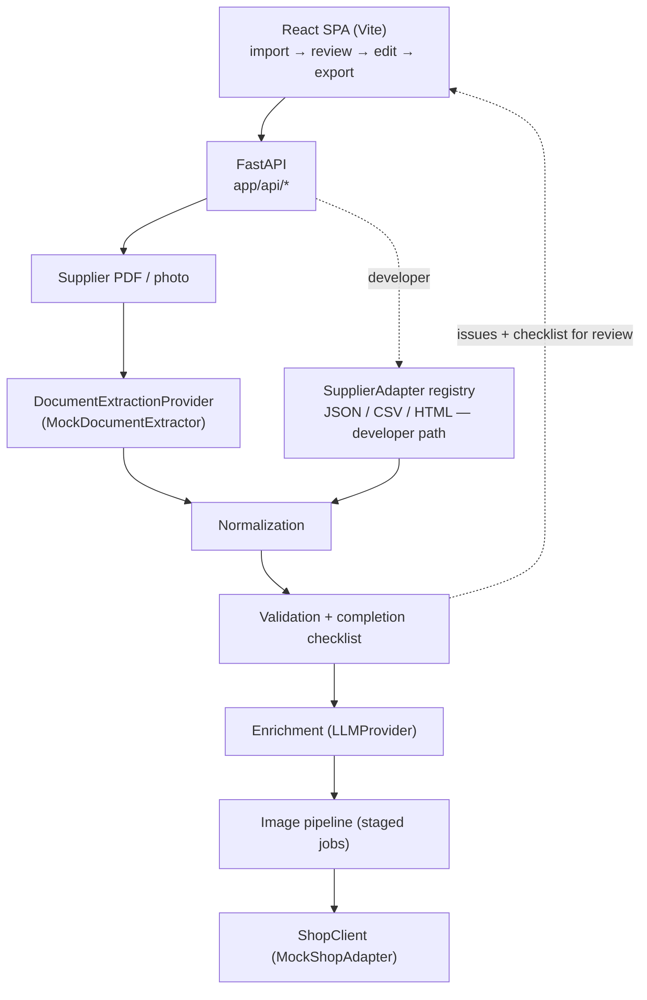

# Product Data Automation Platform

A full-stack product-onboarding platform that automates the path from supplier
documents to shop-ready products.

The production system I developed supports **20+ supplier-specific workflows**
and combines AI-assisted document extraction, product-data normalization,
human review, content and image enrichment, and Shopware integration in one
workflow.

This repository is a public portfolio reimplementation of the core architecture
and workflow using fictional suppliers and offline providers.
Employer code, supplier data, prompts, credentials, and business
rules are not included.

## The problem

Product onboarding was highly manual: supplier documents arrived in different
formats, with inconsistent article numbers, colours, sizes, EANs, pricing, and
product metadata.

Each product had to be extracted, normalized, reviewed, enriched with content
and images, and finally created in Shopware.

With **20+ supplier-specific workflows**, this process became difficult to scale
and easy to get wrong.

The platform turns that fragmented workflow into one structured pipeline with a
human review and editing step before products are published.

## Pipeline

The platform turns supplier input into one standardized product workflow:

```text
Supplier PDF / image
        ↓
Document extraction
        ↓
Raw supplier product
        ↓
Normalization
        ↓
Validation + completion
        ↓
Human review & editing
        ↓
AI-assisted enrichment
        ↓
Image generation
        ↓
Shop export
```



For suppliers that already provide structured data, the platform also supports
JSON, CSV, and HTML imports through `SupplierAdapter`s. Each adapter converts its
input into the same `RawSupplierProduct` format, so the rest of the pipeline can
stay independent of the supplier or source format.

## Architecture

### One product model after normalization

Supplier inputs can look completely different, but after normalization the rest
of the application works with the same `NormalizedProduct` model.

That model contains the supplier-derived data such as article numbers, prices,
variants, material and care instructions, together with fields added during
review and enrichment such as categories, properties and descriptions.

This keeps the downstream pipeline independent of the supplier that originally
provided the product.

### Provider boundaries for external services

External services are hidden behind small provider interfaces. Document
extraction, LLM enrichment, image generation, object storage and shop access can
therefore be replaced without changing the rest of the application.

The public repository uses deterministic offline implementations so the entire
workflow can be run without credentials or external services.

| | Production | Public demo |
|---|---|---|
| Document extraction | Supplier-specific LLM extraction from PDF / image | `MockDocumentExtractor` over bundled fictional documents |
| Suppliers | 20+ configured workflows | 3 fictional suppliers |
| Content enrichment | Hosted LLM | `MockLLMProvider` |
| Product images | External AI image service | `MockImageProvider` |
| Shop integration | Shopware 6 Admin API | `MockShopAdapter` |
| Object storage | Cloud storage | `LocalObjectStorage` |

### Validation and completion are separate

The platform treats incorrect data and incomplete data differently.

`validate()` checks whether the product data itself is valid, for example missing
prices, duplicate sizes or invalid values.

`build_checklist()` checks whether the product is ready to be exported, for
example whether a description or category is still missing.

This distinction is also reflected in the UI: real validation problems are shown
as errors, while unfinished products simply show their completion progress.

### Supplier registry

Structured supplier feeds use registered `SupplierAdapter`s instead of
supplier-specific conditionals throughout the codebase.

Each adapter converts its source format into `RawSupplierProduct`. Adding another
structured supplier therefore means adding a new adapter without changing the
normalization or downstream workflow.

### Backend

| Path | Purpose |
|---|---|
| `app/domain/` | Core models such as `NormalizedProduct`, `Money`, validation types and pricing rules |
| `app/services/extraction/` | Document extraction interface, offline mock and fictional demo-document fixtures |
| `app/suppliers/` | `SupplierAdapter` interface, registry and structured-feed adapters |
| `app/services/` | Normalization, validation, completion, enrichment, image processing and external-service boundaries |
| `app/api/` | FastAPI routes and centralized API error handling |

### Frontend

The frontend is a React/Vite application built around the four main workflow
steps: **import → review → edit & enrich → export**.

`src/lib/api.js` provides the shared API layer, while the editor keeps a separate
editable state for each product and continuously re-evaluates validation and
completion as the user makes changes.

The main editor components live in `src/components/editor/`, with shared UI
components in `src/components/ui.jsx`.

## Technical decisions

| Decision | Why |
|---|---|
| Extraction behind `DocumentExtractionProvider` | The demo runs offline; a real supplier-prompt provider drops in unchanged |
| Bundled documents rendered from the fixtures | The PDF someone opens always matches what the demo "extracts" — one source of truth |
| One `NormalizedProduct` after extraction | The decision that lets the system scale to many suppliers |
| Supplier registry instead of call-site conditionals | Adding a supplier is additive; nothing downstream changes |
| Validation split from completion | "Wrong data" and "not finished yet" are different questions with different UX |
| `Money` as a model, not a float | Amount and currency travel together; rounding is explicit |
| Staged image jobs + injectable job store | Survives a multi-worker deployment without a message broker |
| Errors mapped to HTTP status in one place | Handlers raise domain errors and stay readable |

## Run it

Python 3.11+ and Node 18+. Nothing to configure — every provider is mocked.

```bash
cd backend
python -m venv .venv && . .venv/Scripts/activate    # macOS/Linux: source .venv/bin/activate
pip install -r requirements.txt
uvicorn app.main:app --reload --port 8000            # API + docs at :8000/docs

cd ../frontend
npm install && npm run dev                           # :5173
```

If port 8000 is taken: `uvicorn app.main:app --port 8001` and
`VITE_API_PROXY=http://localhost:8001 npm run dev`.

Then pick a supplier document on the import screen, click **Analyze sample
document**, review the extracted vs. normalized data, edit the products, and
export. Structured feeds (JSON / CSV / HTML) go through *Developer tools* on the
same screen.

## Tests

```bash
cd backend && pytest          # 95 tests
ruff check .
cd ../frontend && npm run build && npx eslint .
```

The backend tests cover document extraction and its failure modes, each adapter's
parsing quirks and malformed input, every validation rule, the checklist, pricing
and size resolution, the enrichment merge, the shop payload builder and its
idempotency, the image pipeline, and the HTTP API end to end.

## My contribution

In the production system I built the supplier registry and the extraction
architecture behind it, the normalized product model and the normalization /
validation stages, the FastAPI backend (routing, request models, the
provider-agnostic LLM layer, the Shopware Admin API client with its idempotent
taxonomy writes and payload builder, and the staged image pipeline with its job
store), the React review frontend, and the test suite.

This repository is my reimplementation of that architecture. Two things differ
from production and are marked as such in the UI: the primary extractor is a mock
(production uses a hosted LLM with a per-supplier prompt, not included here), and
the structured-file adapters are a demo-only entry point.

## Repository layout

```
backend/
  app/
    api/            FastAPI routers + error mapping
    domain/         NormalizedProduct, Money, ValidationIssue, PricingPolicy
    suppliers/      SupplierAdapter interface, registry, 3 adapters
    services/
      extraction/   DocumentExtractionProvider + mock + demo-document fixtures
      llm/          provider interface + deterministic mock
      shop/         shop-client interface + in-memory adapter (payload builder)
      normalization.py / validation.py / completeness.py / enrichment.py / pipeline.py / images.py
    utils/          text + size-range helpers
  tests/
scripts/            generate_demo_documents.py
frontend/src/
  lib/api.js        single API layer
  components/        wizard steps + editor sections + UI kit
demo_data/           the 3 fictional documents + 3 structured feeds
```
