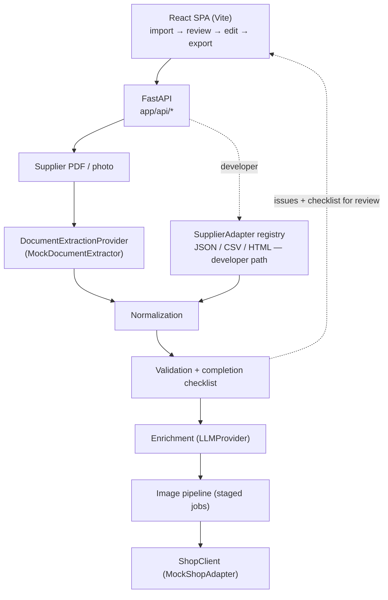

# Product Data Automation Platform

A full-stack product-onboarding platform that automates the path from supplier
documents to shop-ready products.

The production system I developed supports **20+ supplier-specific workflows**
and combines AI-assisted document extraction, product-data normalization,
human review, content and image enrichment, and Shopware integration in one
workflow.

This repository is a public portfolio reimplementation of the core architecture
and workflow using fictional suppliers and offline providers.
Employer code, supplier data, prompts, credentials, and business
rules are not included.

## The problem

Product onboarding was highly manual: supplier documents arrived in different
formats, with inconsistent article numbers, colours, sizes, EANs, pricing, and
product metadata.

Each product had to be extracted, normalized, reviewed, enriched with content
and images, and finally created in Shopware.

With **20+ supplier-specific workflows**, this process became difficult to scale
and easy to get wrong.

The platform turns that fragmented workflow into one structured pipeline with a
human review and editing step before products are published.

## Pipeline

The platform turns supplier input into one standardized product workflow:

```text
Supplier PDF / image
        ↓
Document extraction
        ↓
Raw supplier product
        ↓
Normalization
        ↓
Validation + completion
        ↓
Human review & editing
        ↓
AI-assisted enrichment
        ↓
Image generation
        ↓
Shop export
```



A `SupplierAdapter` (JSON / CSV / HTML) is a second, developer-facing entry point
for suppliers that ship a machine-readable feed. It emits the same
`RawSupplierProduct` and joins the pipeline at `normalize`.

## Architecture

**One canonical model.** Everything after extraction speaks `NormalizedProduct`,
and nothing downstream knows which supplier a product came from. Its fields are
grouped by who fills them: supplier-derived (identity, price, variants, material,
care), reviewer-set (product type, size chart, final categories and properties),
and enrichment (description + suggestions).

**Every external dependency is an interface with an offline mock.** Document
extraction, the LLM, image generation, object storage and the shop are each an
`abc.ABC`; downstream code imports the interface, never a concrete client. A real
provider is a new class and one registration line, and no vendor SDK is imported
outside its provider module.

| | Production | This repo |
|---|---|---|
| Document extraction | supplier-specific LLM prompt over a PDF / image | `MockDocumentExtractor` — reads the bundled fictional documents, refuses anything else |
| Suppliers | around 20 configured | 3 fictional (`AlpineWear`, `UrbanThreads`, `DemoShoes`) |
| LLM (copy + taxonomy) | hosted LLM | `MockLLMProvider` — deterministic templates + token-overlap category matching |
| Images | external AI image service | `MockImageProvider` — inline-SVG placeholders |
| Shop | Shopware 6 Admin API | `MockShopAdapter` — in-memory, builds the full write payload |
| Object storage | cloud drive | `LocalObjectStorage` |

**Two separate quality gates.** `validate()` asks *is the data correct?* and
returns typed `ValidationIssue`s (empty name, missing price, duplicate size).
`build_checklist()` asks *is the product ready to publish?* and returns a typed
checklist. The UI shows the first as errors and the second as completion
progress — a half-filled product gets a progress bar, not a wall of warnings.
Both re-run on every edit.

**Supplier registry, not conditionals.** Adapters register themselves at import
(`registry.register(AlpineWearAdapter())`); there is no `if supplier == "..."`
anywhere. Adding a supplier is additive.

### Backend layout

| Path | What's there |
|---|---|
| `app/domain/` | Pure data + `PricingPolicy`. No I/O, no framework imports. Pydantic v2 models with computed fields. |
| `app/services/extraction/` | `DocumentExtractionProvider` + `MockDocumentExtractor`. `documents.py` holds the bundled documents as fixtures — the single source of truth that `scripts/generate_demo_documents.py` renders into the PDF / JPG. |
| `app/suppliers/` | `SupplierAdapter` interface + registry + 3 adapters. `urbanthreads.py` is the tricky one: a per-size CSV whose rows are grouped back into products, dropping shipping lines and quantity-0 rows. |
| `app/services/` | The stateless stages — `normalization`, `validation`, `completeness`, `enrichment`, `pipeline` — plus the `llm/`, `shop/` and image boundaries. |
| `app/api/` | Thin FastAPI routers. Handlers raise domain errors; `errors.py` maps them to HTTP status codes in one place. |

### Frontend

`App.jsx` is a four-step wizard (import → review → edit → export). `src/lib/api.js`
is the single API layer — every endpoint wrapped, errors normalized to `ApiError`.
`src/components/editor/` is the product editor: `EditorWorkspace` keeps one
editable state object per product, debounces a call to `/review` on every change,
and on a blocked export scrolls to the first unfinished section.
`src/components/ui.jsx` is a small component kit on a restrained Tailwind token
set.

## Technical decisions

| Decision | Why |
|---|---|
| Extraction behind `DocumentExtractionProvider` | The demo runs offline; a real supplier-prompt provider drops in unchanged |
| Bundled documents rendered from the fixtures | The PDF someone opens always matches what the demo "extracts" — one source of truth |
| One `NormalizedProduct` after extraction | The decision that lets the system scale to many suppliers |
| Supplier registry instead of call-site conditionals | Adding a supplier is additive; nothing downstream changes |
| Validation split from completion | "Wrong data" and "not finished yet" are different questions with different UX |
| `Money` as a model, not a float | Amount and currency travel together; rounding is explicit |
| Staged image jobs + injectable job store | Survives a multi-worker deployment without a message broker |
| Errors mapped to HTTP status in one place | Handlers raise domain errors and stay readable |

## Run it

Python 3.11+ and Node 18+. Nothing to configure — every provider is mocked.

```bash
cd backend
python -m venv .venv && . .venv/Scripts/activate    # macOS/Linux: source .venv/bin/activate
pip install -r requirements.txt
uvicorn app.main:app --reload --port 8000            # API + docs at :8000/docs

cd ../frontend
npm install && npm run dev                           # :5173
```

If port 8000 is taken: `uvicorn app.main:app --port 8001` and
`VITE_API_PROXY=http://localhost:8001 npm run dev`.

Then pick a supplier document on the import screen, click **Analyze sample
document**, review the extracted vs. normalized data, edit the products, and
export. Structured feeds (JSON / CSV / HTML) go through *Developer tools* on the
same screen.

## Tests

```bash
cd backend && pytest          # 95 tests
ruff check .
cd ../frontend && npm run build && npx eslint .
```

The backend tests cover document extraction and its failure modes, each adapter's
parsing quirks and malformed input, every validation rule, the checklist, pricing
and size resolution, the enrichment merge, the shop payload builder and its
idempotency, the image pipeline, and the HTTP API end to end.

## My contribution

In the production system I built the supplier registry and the extraction
architecture behind it, the normalized product model and the normalization /
validation stages, the FastAPI backend (routing, request models, the
provider-agnostic LLM layer, the Shopware Admin API client with its idempotent
taxonomy writes and payload builder, and the staged image pipeline with its job
store), the React review frontend, and the test suite.

This repository is my reimplementation of that architecture. Two things differ
from production and are marked as such in the UI: the primary extractor is a mock
(production uses a hosted LLM with a per-supplier prompt, not included here), and
the structured-file adapters are a demo-only entry point.

## Repository layout

```
backend/
  app/
    api/            FastAPI routers + error mapping
    domain/         NormalizedProduct, Money, ValidationIssue, PricingPolicy
    suppliers/      SupplierAdapter interface, registry, 3 adapters
    services/
      extraction/   DocumentExtractionProvider + mock + demo-document fixtures
      llm/          provider interface + deterministic mock
      shop/         shop-client interface + in-memory adapter (payload builder)
      normalization.py / validation.py / completeness.py / enrichment.py / pipeline.py / images.py
    utils/          text + size-range helpers
  tests/
scripts/            generate_demo_documents.py
frontend/src/
  lib/api.js        single API layer
  components/        wizard steps + editor sections + UI kit
demo_data/           the 3 fictional documents + 3 structured feeds
```
