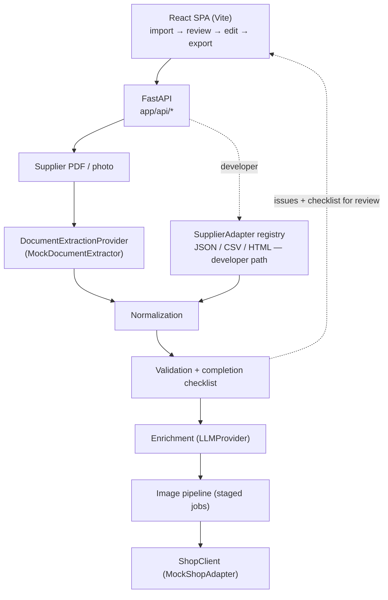
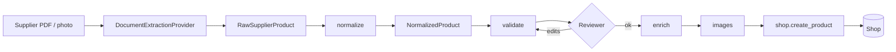

# Product Data Automation Platform

Public portfolio version of an e-commerce product-onboarding platform I built as
a software developer. This repo reimplements the architecture with fictional
suppliers and mock integrations — see [My contribution](#my-contribution).

**The problem.** An e-commerce team received product data from many suppliers,
each in a different format — a JSON feed, a CSV export, an HTML catalogue page, a
PDF order confirmation. Onboarding a product meant repeating the same manual work
every time: pull out the products and variants, reconcile inconsistent article
numbers / colour codes / size runs / EANs, normalize to the shop's product
model, write a description, choose categories, prepare images, catch bad data,
and create the product through the shop's admin API.

**The production codebase contains 20+ supplier-specific extraction workflows**
behind a shared registry, all feeding one common product model and a single
onboarding pipeline:

```
supplier PDF / photo → extract (supplier-specific LLM) → normalize → validate
→ enrich (LLM) → images → human review → shop export
```

Production stack: **FastAPI · Pydantic v2 · React + Vite · pytest**, integrating a
Shopware 6 shop, a hosted LLM for document extraction and copy, an AI image
service, and cloud storage.

**This repository** reimplements that architecture. Every external dependency —
**document extraction**, LLM, image generation, shop, storage — sits behind an
interface with a deterministic **offline mock**, so it runs with no credentials
and no network:

| | Production | This demo |
|---|---|---|
| Document extraction | supplier-specific LLM prompt over a PDF / image | `MockDocumentExtractor` reads bundled fictional documents |
| Suppliers | 20+ configured | 3 fictional (`AlpineWear`, `UrbanThreads`, `DemoShoes`) |

It contains **no proprietary employer code, supplier integrations, prompts,
credentials, or business data** — every supplier, price, taxonomy entry and
business rule in the demo is fictional.

---

## What it demonstrates

- **Document extraction behind an interface** — the pipeline starts with a
  supplier PDF or photo. A `DocumentExtractionProvider` turns it into raw
  products; production is a supplier-specific LLM prompt, this repo ships a
  deterministic `MockDocumentExtractor` over bundled fictional documents. Same
  boundary, no API call. A structured-file adapter (JSON / CSV / HTML) is the
  alternative developer entry point.
- **Heterogeneous supplier data behind a common model** — every extractor and
  adapter emits `RawSupplierProduct`; normalization reduces it to one typed
  `NormalizedProduct` and nothing downstream knows which supplier it came from.
- **Two separate quality gates** — `validate()` checks whether the data is
  *correct* (typed `ValidationIssue`s: bad name, missing price, duplicate size);
  `build_checklist()` checks whether the product is *ready to publish* (a typed
  completion checklist). Well-formed imported data raises no errors — the
  reviewer just finishes a few fields.
- **Provider-independent boundaries** — LLM, image generation, shop and storage
  are each an abstract interface with a mock; no vendor SDK is imported inside
  the pipeline.
- **Staged async image jobs** — a `generating → removing_bg → done` state machine
  with an injectable job store.
- **Idempotent shop payload construction** — one builder assembles a full
  Shopware-shaped write (parent + variants + configurator settings + properties +
  prices) with get-or-create for taxonomy options.
- **Human-in-the-loop review** — a full product editor (general info, images,
  sizes & variants, an expandable category tree, filter properties, a live
  completion rail, export-payload preview), across multiple products with tabbed
  navigation. Export gates on the checklist and scrolls the reviewer to the
  first unfinished section.
- **99 backend tests** — document extraction and its failure modes, adapter
  parsing quirks and malformed input, every validation rule, the completion
  checklist, pricing, size/product-type resolution, the enrichment merge, the
  shop payload builder and its idempotency, the staged image pipeline, and the
  HTTP API end to end.

## Code highlights

| File / folder | Why it's worth a look |
|---|---|
| [`backend/app/services/extraction/`](backend/app/services/extraction) | `DocumentExtractionProvider` (the production-boundary) + `MockDocumentExtractor`: deterministic, offline, only recognizes the bundled documents (an arbitrary PDF raises `DocumentNotRecognized`, mirroring the real failure mode). The fixtures in `documents.py` are the single source of truth — [`scripts/generate_demo_documents.py`](scripts/generate_demo_documents.py) renders them into the PDF/JPG a recruiter opens. |
| [`backend/app/domain/models.py`](backend/app/domain/models.py) | The single representation every stage speaks — `NormalizedProduct`, `Money`, `Variant`, `ValidationIssue`, `SourceDocument`. Pydantic v2 with computed fields. |
| [`backend/app/suppliers/`](backend/app/suppliers) | The `SupplierAdapter` interface + registry and 3 concrete adapters (the developer entry point). [`urbanthreads.py`](backend/app/suppliers/urbanthreads.py) is the interesting case: a per-size CSV whose rows must be **grouped back** into products, with shipping pseudo-lines and quantity-0 rows dropped. |
| [`backend/app/services/shop/mock_adapter.py`](backend/app/services/shop/mock_adapter.py) | `_build_payload` assembles the full product write in one place; `upsert_property_option` is idempotent. Mirrors the structure of the real Shopware Admin API client. |
| [`backend/app/services/images.py`](backend/app/services/images.py) | Staged job model + `JobStore` interface (in-memory here; production used an on-disk store re-read per call so jobs survive multiple worker processes). Image provider is swappable. |
| [`frontend/src/lib/api.js`](frontend/src/lib/api.js) | The frontend's single API layer — all backend calls go through here, every endpoint wrapped, errors normalized to `ApiError`, payload shapes documented with JSDoc typedefs. |
| [`frontend/src/components/editor/`](frontend/src/components/editor) | The product editor: [`EditorWorkspace`](frontend/src/components/editor/EditorWorkspace.jsx) holds per-product state + a debounced call to the real `/review` endpoint; sections are controlled components; [`CategoriesSection`](frontend/src/components/editor/CategoriesSection.jsx) builds an expandable tree from flat category paths. |

## Architecture



Two flows into the pipeline:

| | Production | Public demo |
|---|---|---|
| **Primary** | supplier PDF / image → supplier-specific LLM prompt → `RawSupplierProduct[]` | bundled fictional PDF / image → `MockDocumentExtractor` → `RawSupplierProduct[]` |
| **Developer** | — | a structured feed (JSON / CSV / HTML) → `SupplierAdapter.parse()` → `RawSupplierProduct[]` |

The pipeline in this repo, after extraction:

1. **Normalize** — raw products collapse into one `NormalizedProduct` (stable
   SKU, display name, typed price, variants with per-size EANs).
2. **Validate + checklist** — named rules emit `ValidationIssue`s for bad data;
   `build_checklist()` produces a typed completion checklist. Both re-run on
   every edit.
3. **Enrich** — the LLM provider writes a description and merges suggested
   categories/properties (non-destructively) from the live shop taxonomy.
4. **Images** — 1–N staged jobs (model shot / lifestyle / packshot).
5. **Edit & review** — a product editor with sections for general info, images,
   sizes & variants (product type → size run → per-size EANs), the category tree,
   and filter properties; a sticky rail shows the summary and completion state.
6. **Export** — gated on the checklist; the shop client builds the write payload
   and creates the product; the UI shows the exact payload.

## Workflow



## Engineering challenges

- **Extraction is a boundary, not a hard dependency.** Production sends the
  document to a hosted LLM with a supplier-specific prompt; the demo runs a
  deterministic mock. Downstream code never knows which ran — it only sees
  `RawSupplierProduct`. The mock still models the real failure mode
  (`DocumentNotRecognized` for an unknown layout).
- **Heterogeneous supplier formats.** For the developer adapters: JSON with
  nested size/EAN maps; CSV with one physical row per size that must be grouped
  back into products; HTML where the only "don't order this size" signal is a CSS
  class. Each mess stays contained to one adapter file.
- **Malformed / missing supplier data.** Adapters extract, they don't guess —
  missing data is `None`, and validation is a separate stage. Order-confirmation
  quirks (cancelled lines, shipping pseudo-rows, quantity-0 rows) are handled
  explicitly.
- **Reusable transformation logic.** Pricing is a configurable `PricingPolicy`
  object, not scattered arithmetic; size-range resolution is one utility.
- **External-service reliability.** Image jobs are staged state in an injectable
  store (production: an on-disk store re-read every call, so jobs survive across
  worker processes). Provider rate-limit errors are normalized to one typed error
  mapped to HTTP 402 at the edge.
- **Human-in-the-loop review.** LLM output is never trusted blind — the review
  screen shows source vs. normalized data, and the editor exposes product
  readiness as a completion checklist rather than as scary "errors".
- **Maintainability.** Narrow interfaces, small cohesive modules, typed models,
  and a test per behaviour.

## Technical decisions

| Decision | Why |
|---|---|
| Document extraction behind `DocumentExtractionProvider` | The demo runs offline and truthfully; a real supplier-prompt provider is a drop-in |
| Bundled documents rendered from the extraction fixtures | The PDF a recruiter opens always matches what the demo "extracts" — one source of truth |
| Supplier *registry*, not conditionals at call sites | Adding a supplier is additive; nothing downstream changes |
| One `NormalizedProduct` for everything after extraction | The core decision that lets the system scale to many suppliers |
| Pydantic models end to end | Request validation + OpenAPI for free; typed money and variants |
| Provider interfaces for extraction / LLM / images / storage / shop | No vendor lock-in; demo runs offline; each has a mock |
| Validation split from completion | "Wrong data" and "not finished yet" are different questions — the UI shows the second as progress, not errors |
| `Money` as a model, not a float | Rounding + currency travel together; JSON stays explicit |
| Staged image jobs + injectable job store | Survives multi-worker deployments without a message broker |
| Errors mapped to HTTP status in one place | Handlers raise domain errors and stay readable |

## Run the demo

Prerequisites: Python 3.11+ and Node 18+. Nothing to configure — every provider
is mocked.

```bash
# backend → http://localhost:8000  (API docs at /docs)
cd backend
python -m venv .venv && . .venv/Scripts/activate     # macOS/Linux: source .venv/bin/activate
pip install -r requirements.txt
uvicorn app.main:app --reload --port 8000

# frontend → http://localhost:5173
cd frontend && npm install && npm run dev
```

If port 8000 is taken, run the backend elsewhere and point the dev proxy at it:
`uvicorn app.main:app --port 8001` + `VITE_API_PROXY=http://localhost:8001 npm run dev`.

Then, in the browser:

1. On the import screen, pick a supplier document (e.g. *AlpineWear_OrderConfirmation.pdf*)
   and click **Analyze sample document** — "Analyzing document with AI…" → "4 products
   extracted". (Click **View** to open the fictional PDF itself.)
2. On the review screen the header reads *Extracted 4 products from
   AlpineWear_OrderConfirmation.pdf* with an "AI extraction · mocked in demo"
   badge. Expand a row to compare the extracted vs. normalized data; select the
   products to onboard.
3. In the editor, per product: **Generate description & suggestions**, add
   **images**, set the **product type** and **size range**, pick **categories**
   and **properties**, fill **material / care**, watch the completion rail fill,
   then **Export to demo shop** and inspect the write payload.

Structured feeds (JSON / CSV / HTML) go through *Developer tools* on the import
screen instead.

## Regenerating the demo documents

The bundled PDFs / image live in `demo_data/documents/` and are committed. To
rebuild them from the fixtures in `app/services/extraction/documents.py`:

```bash
pip install pillow          # only needed to regenerate the .jpg
python scripts/generate_demo_documents.py
```

## Screenshots

> **To be added.** Real demo screenshots (public demo data only) are not yet
> captured — run the demo above and place PNGs in `docs/screenshots/`.

| View | File |
|---|---|
| Supplier documents + "Analyzing with AI…" | `docs/screenshots/01-import.png` |
| Extracted → normalized review | `docs/screenshots/02-review.png` |
| Full product editor | `docs/screenshots/03-editor.png` |
| Images & variants | `docs/screenshots/04-images-variants.png` |
| Categories & properties | `docs/screenshots/05-categories-properties.png` |
| Completion & export | `docs/screenshots/06-export.png` |

## Testing

```bash
cd backend
pip install -r requirements.txt
pytest                    # 99 tests
ruff check .

cd ../frontend
npm run build             # production build; also catches import / JSX errors
npx eslint .
```

## Production vs. public version

| | Production system | Public demo (this repo) |
|---|---|---|
| Suppliers | 20+ configured supplier workflows | 3 fictional suppliers |
| Document extraction | supplier-specific LLM prompt over a PDF / photo | `MockDocumentExtractor` over bundled fictional documents (deterministic, offline) |
| Extraction prompts | proprietary, one per supplier | **not reproduced** — the mock returns fixed fixtures |
| Structured-feed adapters | — | `SupplierAdapter` (JSON / CSV / HTML), a developer-facing alternative entry point |
| Business data | Real | Generated, fictional |
| Shop integration | Shopware 6 Admin API | `MockShopAdapter` (in-memory) |
| LLM (extraction + copy) | Hosted LLM provider | `MockDocumentExtractor` + `MockLLMProvider` (deterministic, offline) |
| Image generation | External AI image service | `MockImageProvider` (inline-SVG placeholders) |
| Object storage | Shared cloud drive | `LocalObjectStorage` |
| Credentials | Private, in `.env` | **None** — nothing to configure |
| Pricing / margins | Confidential rule | Illustrative placeholder `PricingPolicy` |

## My contribution

The original project's git history shows a single author for essentially all
application code (one unrelated CI-config commit came from an org account). On
that basis, in the production system I designed and built:

- the **supplier registry and reusable extraction architecture** — a registry of
  20+ supplier-specific extraction workflows feeding one normalized product
  model, so onboarding a supplier is a configuration change rather than new code;
- the **normalized product model** and the normalization / validation stages;
- the **FastAPI backend** — routing, request models, the provider-agnostic AI
  layer (two interchangeable LLM providers), the Shopware Admin API client (OAuth
  token lifecycle, idempotent taxonomy writes, the product payload builder), and
  the staged image pipeline with its multi-worker-safe job store;
- the **React frontend** — the multi-step review wizard, the typed API layer, the
  enrichment UI, and the image-job polling components;
- the **test suite**.

This public repository is my reimplementation of that architecture. Two public-repo
design choices differ from production and are called out as such in the UI and
docs: the primary extractor is a `MockDocumentExtractor` (production uses a hosted
LLM with a supplier-specific prompt, not reproduced here), and the structured-file
`SupplierAdapter` classes are a demo-only alternative entry point.

## Repository layout

```
backend/
  app/
    api/            FastAPI routers (documents, suppliers, catalog, products) + error mapping
    domain/         NormalizedProduct, Money, ValidationIssue, SourceDocument, PricingPolicy
    suppliers/      SupplierAdapter interface, registry, 3 concrete adapters (developer path)
    services/
      extraction/   DocumentExtractionProvider + MockDocumentExtractor + demo-document fixtures
      llm/          provider interface + deterministic mock
      shop/         shop-client interface + in-memory adapter (payload builder)
      completeness.py  the "ready to publish?" checklist
      images.py     staged image pipeline + injectable job store
      normalization.py / validation.py / pipeline.py / enrichment.py / storage.py
    utils/          text + size-range helpers
  tests/            99 tests
scripts/            generate_demo_documents.py — renders the bundled PDFs / JPG
frontend/src/
  lib/api.js        single typed API layer
  components/       wizard steps + editor sections + shared UI primitives
demo_data/
  documents/        the 3 fictional supplier documents (PDF / JPG)
  *.json/.csv/.html  the 3 structured feeds (developer path)
docs/               architecture notes + screenshots
```

## License

MIT — see [`LICENSE`](LICENSE).
